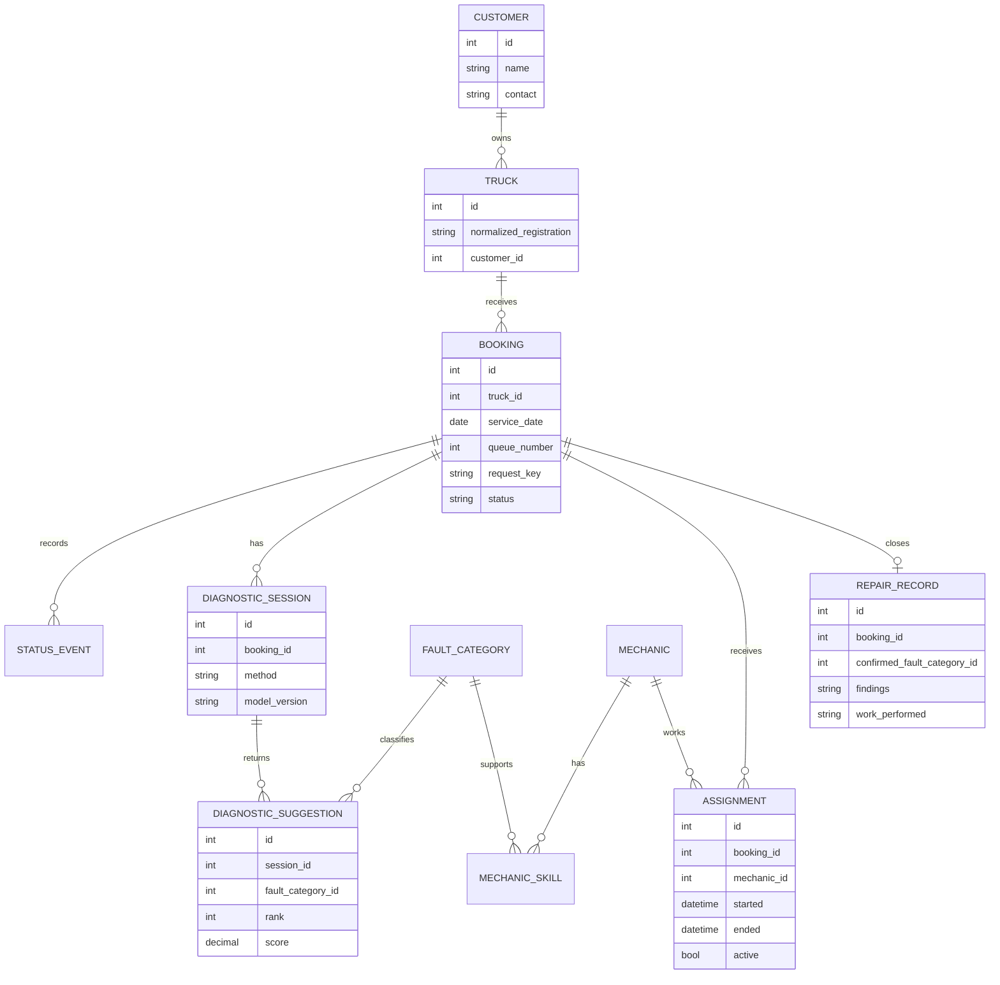

```mermaid
erDiagram
 CUSTOMER ||--o{ TRUCK : owns
 TRUCK ||--o{ BOOKING : receives
 BOOKING ||--o{ STATUS_EVENT : records
 BOOKING ||--o{ DIAGNOSTIC_SESSION : has
 DIAGNOSTIC_SESSION ||--o{ DIAGNOSTIC_SUGGESTION : returns
 FAULT_CATEGORY ||--o{ DIAGNOSTIC_SUGGESTION : classifies
 MECHANIC ||--o{ MECHANIC_SKILL : has
 FAULT_CATEGORY ||--o{ MECHANIC_SKILL : supports
 BOOKING ||--o{ ASSIGNMENT : receives
 MECHANIC ||--o{ ASSIGNMENT : works
 BOOKING ||--o| REPAIR_RECORD : closes
 CUSTOMER { int id string name string contact }
 TRUCK { int id string normalized_registration int customer_id }
 BOOKING { int id int truck_id date service_date int queue_number string request_key string status }
 DIAGNOSTIC_SESSION { int id int booking_id string method string model_version }
 DIAGNOSTIC_SUGGESTION { int id int session_id int fault_category_id int rank decimal score }
 ASSIGNMENT { int id int booking_id int mechanic_id datetime started datetime ended bool active }
 REPAIR_RECORD { int id int booking_id int confirmed_fault_category_id string findings string work_performed }
```
